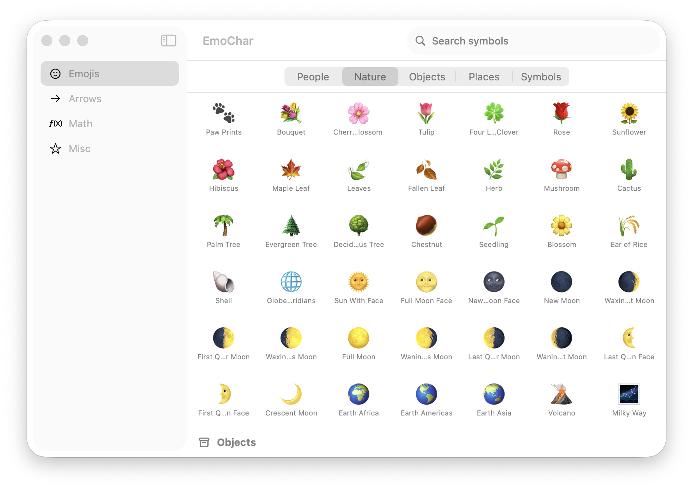

# EmoChar

A macOS utility app for browsing and copying emojis and Unicode symbols. Select any character and it's instantly copied to your clipboard.

<p align="center">
  
</p>

## Features

- **500+ emojis** organized into People, Nature, Objects, Places, and Symbols — matching the GitHub emoji set
- **Unicode symbols** in three additional categories: Arrows & Geometric, Math & Currency, Misc Symbols
- **Click to copy** — clicking any character copies it to the clipboard with a brief "Copied!" confirmation
- **Search** — filters across all characters in the active category
- **Category switcher** — segmented control inside the emoji view scrolls directly to any sub-category



## Requirements

- macOS 13 or later
- Xcode 15+

## Getting Started

```bash
# Install xcodegen if needed
brew install xcodegen

# Generate the Xcode project
xcodegen generate

# Open in Xcode
open EmoChar.xcodeproj
```

Then build and run with **⌘R**.

## Project Structure

```
project.yml          # xcodegen config — source of truth for the Xcode project
src/
├── EmoCharApp.swift
├── ContentView.swift
├── Models/
│   └── Symbol.swift         # SidebarItem, SymbolCategory, SymbolItem
├── Data/
│   └── SymbolData.swift     # All symbol data grouped by category
└── Views/
    ├── SidebarView.swift
    ├── EmojiContentView.swift   # Sectioned emoji grid + category switcher
    ├── SymbolGridView.swift
    └── SymbolCellView.swift     # Click-to-copy cell with hover state
```

## Adding Symbols

Add entries to the relevant array in `src/Data/SymbolData.swift`. New emoji sub-categories require a new case in `SymbolCategory` and a corresponding entry in `SymbolData.items(for:)`.
